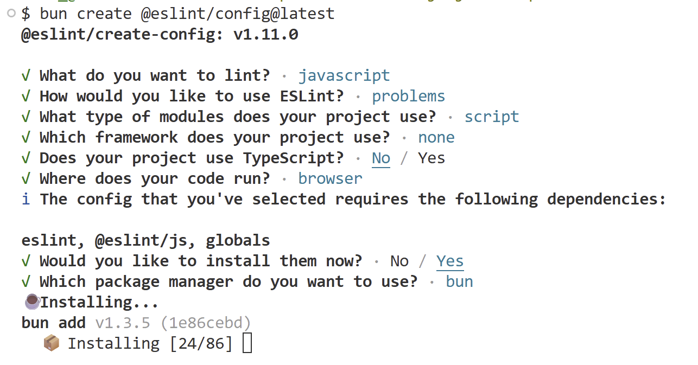

✨2026-01-19 월요일

# 디버깅

### 🔍 초보자와 전문가의 차이

- **초보자 (압도되는 태도)**
  오류 메시지를 마주하면 당황하거나 자신의 논리를
  맹신하며 오류 상황 자체에 스트레스를 받습니다.
- **전문가 (분석적인 태도)**
  오류를 실패가 아닌, '더 나은 코드를 위한 기회'로 받아들입니다.
  침착하게 원인을 분석하며 해결 과정을 즐깁니다.

### 🔍 디버깅이 가지는 의미

디버깅은 단순히 버그를 잡는 기술이 아니라, **시스템을 깊이 이해하고
논리적 사고를 훈련하는 과정**입니다. 완벽한 코드를 짜는 것보다 '문제를
분석하고 수정해 나가는 태도'가 숙련된 개발자의 핵심 역량입니다.

### 🔍 구문오류와 논리적 오류

| **구분**        | **특징**                      | **비유**                                     |
| --------------- | ----------------------------- | -------------------------------------------- |
| **구문 오류**   | 문법이 틀려 실행 자체가 안 됨 | 말이 아예 통하지 않는 상태                   |
| **논리적 오류** | 실행은 되지만 결과가 엉뚱함   | 레시피대로 했지만 설탕 대신 소금을 넣은 상태 |

### 🔍 전문가의 디버깅 전략

- **현상 관찰 :** 오류가 발생하는 정확한 시점과 단계를 파악합니다.
- **가설 설정 :** 의심되는 지점을 좁혀 원인을 추측합니다.
- **흐름 추적 :** 중단점(Breakpoint)이나 로그를 통해 데이터 변화를 한 줄씩 살핍니다.
- **러버덕 디버깅 :** 인형이나 동료에게 코드를 설명하며 스스로 논리적 모순을 깨닫습니다.

# 린터 (Linter) : 코드의 맞춤법 검사기

- 린터는 코드를 실행하기 전, 잠재적 에러나 스타일 문제를 실시간으로 찾아주는 도구입니다. 에디터에 나타나는 구불구불한 빨간 밑줄이 바로 린터의 신호입니다.

- **버그 예방:** 실행 전 오타나 논리적 실수를 미리 발견합니다.
- **협업 효율:** 팀원 간의 코드 스타일을 하나로 통일합니다.
- **품질 향상:** "안 쓰는 변수 제거" 등 더 나은 코드 작성을 유도합니다.

### 🛠️ 설치 방법

1. 설치

```
bun create @eslint/config@latest
```

2. 해당 이미지처럼 설정하여 설치



3. 실행하기

```
$ bunx eslint myFile.js
```

### 🔍 ESLint 구성

1. [ESLint 설치](https://eslint.org/docs/latest/use/getting-started#quick-start)

   ```bash
   bun create @eslint/config@latest
   ```

2. ESLint 명령어를 사용해 JavaScript 파일을 검사하고 결과를 확인합니다.

   ```bash
   bunx eslint yourfile.js
   ```

3. 검사할 파일을 생성하고 아래 코드를 복사 붙여넣은 후, 검사한 후 확인된 문제를 해결해봅니다.

   ```jsx
   if (true) {
     console.log("참입니다!");
   } else {
     console.log("거짓입니다!");
   }
   ```

   ```jsx
   let link

   link = document.querySelector('.link')
   console.log(link)

   button.addEventListener('click', () = {
     console.log('버튼 클릭!")
   }}
   ```

### mjs / cjs 차이점

## CJS(CommonJS) vs MJS(ES Modules) 비교

| 구분            | CJS (CommonJS)                            | MJS (ES Modules)                           |
| --------------- | ----------------------------------------- | ------------------------------------------ |
| 확장자          | `.cjs` (기본적으로 `.js`)                 | `.mjs` (설정 시 `.js`)                     |
| 불러오기 문법   | `require()`                               | `import`                                   |
| 내보내기 문법   | `module.exports` / `exports`              | `export` / `export default`                |
| 동작 방식       | 동기(Synchronous)<br>로드 완료까지 대기   | 비동기(Asynchronous)<br>성능 최적화에 유리 |
| 트리 쉐이킹     | ❌ 지원 안 함<br>(전체 로드)              | ✅ 지원함<br>(필요한 코드만 로드)          |
| 사용 환경       | 기존 Node.js 환경                         | 브라우저 및 현대적 Node.js 표준            |
| Top-level await | ❌ 불가능<br>(async 함수 내부에서만 가능) | ✅ 가능                                    |

- CJS → 과거 Node.js 중심, 단순하지만 최적화에 불리
- MJS → 현재 표준, 브라우저·번들러·성능 최적화에 유리

# 배열 Array

### 1. 배열이란?

- 여러 값을 순서대로 저장하는 데이터 구조
- JavaScript에서 배열은 특별한 객체
- 목록(장보기 리스트 등)을 표현할 때 사용

```jsx
const shoppingCart = ["두부", "양파", "대파"];
```

### 2. 배열 생성 방법

✅ 기본 방식 (권장)
⚠️ 생성자 방식 (비권장)
