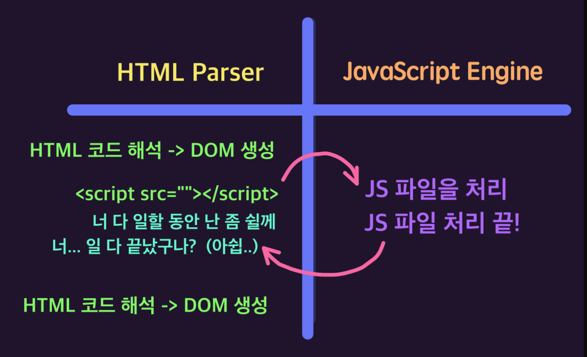

✨2026-01-14 수요일

# bun 개발환경 설정

CLI

```cli
bun add live-server -D (개발용 서버)
```

package.json

```jsx
{
  "scripts": {
    //"단축명령어": "패키지이름(명령어) --옵션1=값 --옵션2=값",
    "dev": "live-server --host=localhost --port=3000 --no-browser",
    "dev:bun": "bun learn.html"
  },
  "dependencies": {
    "live-server": "^1.2.2"
  }
}
```

- npm 설정사이트 : https://www.npmjs.com/package/live-server

# DOM 요소 선택

ℹ️ 참고 사이트

- [MDN Web Docs (Mozilla): document.getElementById() - 실질적인 표준 가이드](https://developer.mozilla.org/ko/docs/Web/API/Document/getElementById)

- [WHATWG DOM Living Stand ard: getElementById 인터페이스 정의](https://dom.spec.whatwg.org/)

## DOM 작동방식



학습: 브라우저의 작동 흐름

- HTML Parser 의 작동 구조
- JavaScript Engine 의 작동 구조
- <script> 요소의 defer 속성의 필요성
- DOMContentLoaded 이벤트(Event)

&&는 거짓을 찾아요 !
||는 참을 찾으니까 !

live-server install !!!

설치하려는 파일 안으로 들어간다 ! cd ~ 파일이름
이제 라이브서버를 설치한다 !

명령어 : bun add live-server

"단축명령어": "패키지이름(명령어) --옵션1=값 --옵션2=값",

추가한 dev옵션들
--host=localhost :
--port=3000 :
--no-browser :

---

- HTML Parser 의 작동 구조
- JavaScript Engine 의 작동 구조
- <script> 요소의 defer 속성의 필요성
- DOMContentLoaded 이벤트(Event)

학습: 문서 또는 특정 요소의 내부 요소 집합(NodeList) 가져오기

# 단수

- document.querySelector
- element.querySelector

# 복수

- document.querySelectorAll
- element.querySelectorAll

DTD Document Type Definition (문서 형식 정의)

표준모드 문서 형식 선언 / 표준모드로 들어감 !\*\*

null이 발생하는 원인: 동기적 파싱
전통적인 최적화: <body> 하단 배치
현대적인 해결책: defer 속성

---

DOM 요소 선택
getElementById
ID 를 찾아낼때는 효율적임 !!! 제일 빠름

document.querySelector
document 객체가 가진 이 메서드는 CSS 선택자를 인자로 받아, 전체 문서에서 요소를 찾아옴

.sr-only = screen reader only

=============================
학습: 브라우저의 작동 흐름

- HTML Parser 의 작동 구조
- JavaScript Engine 의 작동 구조
- <script> 요소의 defer 속성의 필요성
- DOMContentLoaded 이벤트(Event)

학습: 문서에서 요소 찾기

- 타입 변환 (Boolean)
- 타입 변환 후, 조건 처리
- 가독성 좋은 코드

학습: 코드 재사용의 필요성

- 결론은 함수 (재사용성)
- 기능이 필요함을 인지
- 함수를 구현하는 능력

학습: 특정 요소 내부에서 하위 요소 찾기

- 복잡한 CSS 선택자 사용 권장 안함 (성능 저하)
- 변수를 사용해 특정 범위 요소 메모리(기억)
- 기억된 요소 내부에서 하위 요소를 찾는 방법 권장

학습: 문서 또는 특정 요소의 내부 요소 집합(NodeList) 가져오기

# 단수

- document.querySelector
- element.querySelector

# 복수

- document.querySelectorAll
- element.querySelectorAll

학습: 문서에서 name 속성 값이 일치하는 요소 집합 찾기 API

- document.getElementsByName

학습: 다양한 웹 API(함수)를 사용해 문서의 요소 찾기 실습

- 태그 이름으로 찾기
- 선택자로 찾기
- 클래스 이름으로 찾기
- 속성 이름, 값으로 찾기

==========================================
